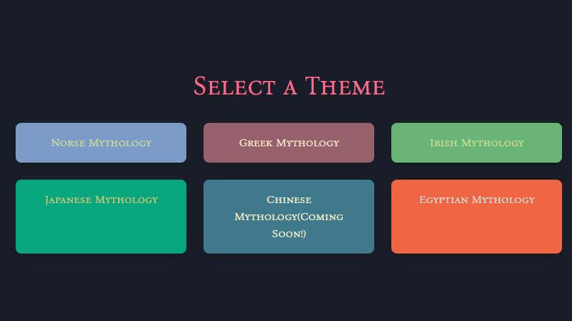
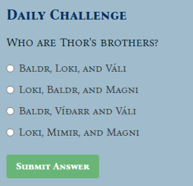

## Mythology Trivia Game

**Lore Master** is an interactive mythology-themed trivia game where players test their knowledge across five mythological themes — Norse, Greek, Japanese, Irish, and Egyptian. The game features daily challenges, persistent user profiles, and a leaderboard to fuel some friendly divine competition.

This project is a love letter to mythology and a showcase of my full-stack development skills. Built using Flask, PostgreSQL, and React with Redux, it combines a responsive UI with robust backend functionality, JWT-based authentication, and database-driven game logic.

---

## Table of Contents

- [Features](#features)
- [Usage](#usage)
- [Gameplay](#gameplay)
- [Daily Challenges](#daily-challenges)
- [Leaderboard](#leaderboard)
- [Coming Soon](#coming-soon)
- [Technologies Used](#technologies-used)

---

## Features

- **Five Mythology Game Boards** – Greek, Norse, Japanese, Irish, and Egyptian
- **User Authentication** – JWT-based login and registration
- **Score Tracking** – Points for correct answers, time penalties for wrong ones
- **Timer + Pause** – Games are timed with pause/resume support
- **Daily Challenge** – A fresh question each day
- **Leaderboard** – Top 10 players ranked by score
- **User Profiles** – Track progress and view stats
- **Power-Ups System** – (Planned) Bonus features for active players

---

## Gameplay



- Choose a mythology-themed game board to begin.
- Earn points for correct answers and extra seconds.
- Incorrect answers cost you time.
- Game can be paused and resumed.
- View your final score and compare it on the leaderboard.

---

## Daily Challenges



- Players can attempt the **Daily Challenge** once per day. Currently, the daily challenge serves as a practice question. In future updates, completing the challenge will reward players with special items or bonuses.

---

## Leaderboard

The top 10 players are ranked by total score. Users can improve their score by playing themed boards and the daily challenge.

---

## Coming Soon

- **Chinese Mythology Gameboard:** A thematic expansion featuring questions related to Chinese mythology.
- **Admin Panel:** A dedicated interface for managing game data, player stats, and other controls.
- **Question Updates:** Regular updates to the question pools will ensure fresh content!

---

## Technologies Used

**Frontend**

- React
- Redux
- Tailwind CSS (using @apply in a custom CSS file for easier debugging)

**Backend**

- Flask
- Flask-JWT-Extended
- Flask-Migrate
- SQLAlchemy

**Database**

- PostgreSQL

---

### Database ERD


## Installation and Setup

### BACKEND SETUP

1. Clone repo:

```bash
git clone [https://github.com/cameronotoole44/milestoneProject03]
cd mythology-trivia/backend
```

2. Create and activate a virtual environment:

```bash
python -m venv venv
# On Windows (Command Prompt)
venv\Scripts\activate
# On Windows (Git Bash, WSL, or other Unix-like shells)
source venv/Scripts/activate
# On Linux/Mac
source venv/bin/activate
```

3. Install Python dependencies:

```bash
pip install -r requirements.txt
```

4. Set up your PostgreSQL database:

- Create new database
- Update your .env with your database credentials

```bash
SECRET_KEY=your_flask_secret
JWT_SECRET_KEY=your_jwt_secret

POSTGRES_USER=your_pg_user
POSTGRES_PASSWORD=your_pg_password
POSTGRES_DB=your_db_name
PGHOST=localhost
PGPORT=5432

```

5. Initialize database:

```bash
flask db upgrade
```

6. Start the Flask server:

```bash
flask run
```

### FRONTEND SETUP

1. Navigate to frontend directory:

```bash
cd /frontend/mythology-trivia-game
```

2. Install Dependencies:

```bash
npm install
```

3. Start development server:

```bash
npm start
```
